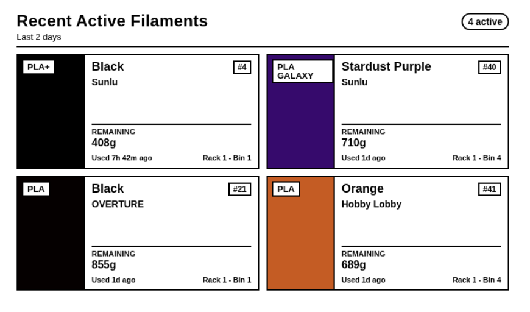
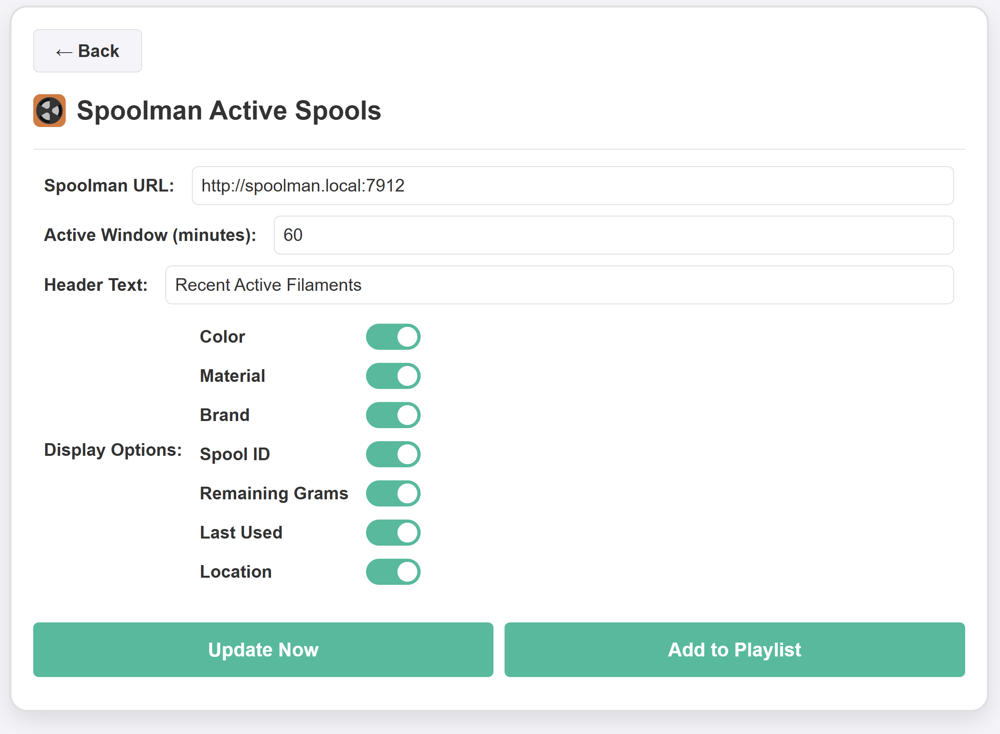

# InkyPi Spoolman Active Spools

A custom InkyPi plugin that shows recently active Spoolman spools on an e-paper display with a clean, glanceable layout and configurable display fields.

## Install

Use the InkyPi plugin installer with the plugin ID and this repository URL, following the install pattern shown by the official InkyPi plugin template.

```bash
inkypi plugin install spoolman_active_spools https://github.com/shadal18/inkypi-spoolman-active-spools
```

## Update

To update the plugin on your InkyPi device:

1. SSH into your InkyPi host.
2. Change into the plugin directory:
   ```bash
   cd ~/InkyPi/src/plugins/spoolman_active_spools
   ```
3. Run this update command:
   ```bash
   git pull origin main && \
   if [ -d spoolman_active_spools ]; then \
     shopt -s dotglob nullglob && \
     mv spoolman_active_spools/* . && \
     rmdir spoolman_active_spools; \
   fi && \
   sudo systemctl restart inkypi.service
   ```

If you don’t see your changes after updating:

- Confirm you are in the correct plugin folder.
- Clear your browser cache or hard refresh the InkyPi web UI.
- Check the InkyPi logs for any plugin errors.

## Requirements

- A working InkyPi installation with plugin support.
- A reachable Spoolman instance with its API available over HTTP.
- Network access from the InkyPi device to the Spoolman host.

## Features

This plugin is an extension for the InkyPi e-paper display frame and includes the following features.

- Shows recently active Spoolman spools.
- Configurable active time window.
- Color-focused spool display for quick identification.
- Optional material display.
- Optional brand display.
- Optional spool ID display.
- Optional remaining grams display.
- Optional last used display.
- Optional location display.
- Clean layout optimized for quick glance reading on e-paper.
- Human-readable active window labels such as minutes, hours, and days.

## Settings

- Spoolman URL.
- Active window in minutes.
- Header text.
- Show or hide color.
- Show or hide material.
- Show or hide brand.
- Show or hide spool ID.
- Show or hide remaining grams.
- Show or hide last used.
- Show or hide location.

## Repository

GitHub repository:

[https://github.com/shadal18/inkypi-spoolman-active-spools](https://github.com/shadal18/inkypi-spoolman-active-spools)

## Screenshots

- Main plugin display showing active spools.
- Plugin settings screen.

<p align="center">
  
  
</p>
